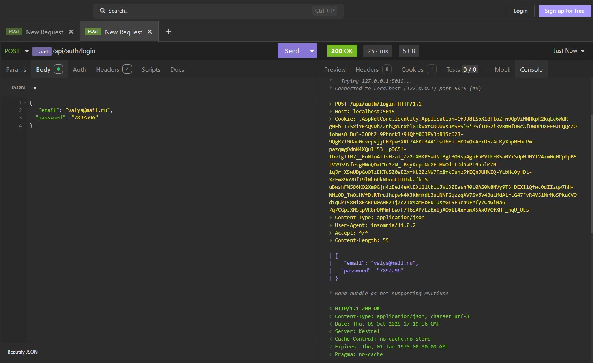

## Описание
Это веб-приложение для управления рестораном, включающее бронирование столиков, администрирование меню и пользователей, а также REST API для взаимодействия с внешними клиентами.
Проект реализован на ASP.NET Core 9.0 с использованием Entity Framework Core и Identity.


## Возможности
### Пользователи:
- Регистрация и авторизация через систему Identity;
- Создание бронирования.
### Администратор:
- Управление пользователями (добавление, редактирование, удаление);

- Управление меню ресторана (добавление блюд, редактирование, удаление);

- Просмотр и управление бронированиями;

- Панель администратора для контроля контента и пользователей (добавление, редактирование, удаление).

## Технологический стек

| Компонент        | Используемая технология                         |
|------------------|--------------------------------------------------|
| Язык             | C#                                               |
| Фреймворк        | ASP.NET Core 9.0                                |
| ORM              | Entity Framework Core                           |
| База данных      | Microsoft SQL Server                            |
| Аутентификация   | ASP.NET Core Identity                           |
| API              | REST API (ASP.NET Core Web API)                 |
| Frontend         | Razor Pages, Bootstrap 5, JavaScript            |
| Стилизация       | CSS (stylerest.css, styleadmin.css)             |
| Менеджер пакетов | npm (Bootstrap)                                 |

## Запуск и установка

1. Клонирование репозитория (ветка EFIdentity)

`git clone https://github.com/Tat-T/Restaurant.git`

`cd Restaurant`

`git checkout EFIdentity`

2. Настройка базы данных

Отредактируй строку подключения в appsettings.json:

"ConnectionStrings": {
    "DefaultConnection": "Server=DESKTOP-NKNKVEQ\\SQLEXPRESS;Database=RestaurantDB;Trusted_Connection=True;MultipleActiveResultSets=true;TrustServerCertificate=True"
  }

3. Применение миграций

`dotnet ef database update`

4. Запуск проекта

`dotnet run`

или открой проект в Visual Studio → F5

После запуска приложение будет доступно по адресу:

https://localhost:5015

### Данные для проверки

```
Вход для администратора:

E-mail: admin@mail.ru

Password: 3012867Lf

Вход для авторизованного пользователя:

E-mail: lara@mail.ru

Password: 123456Lf
```

### Пример API-запроса


