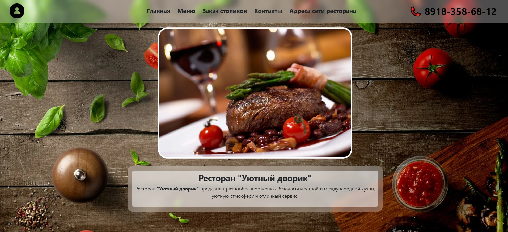
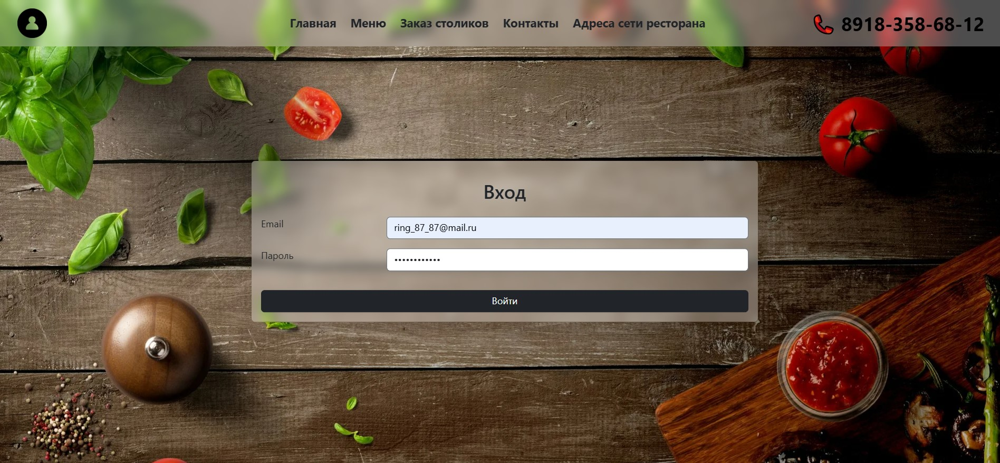
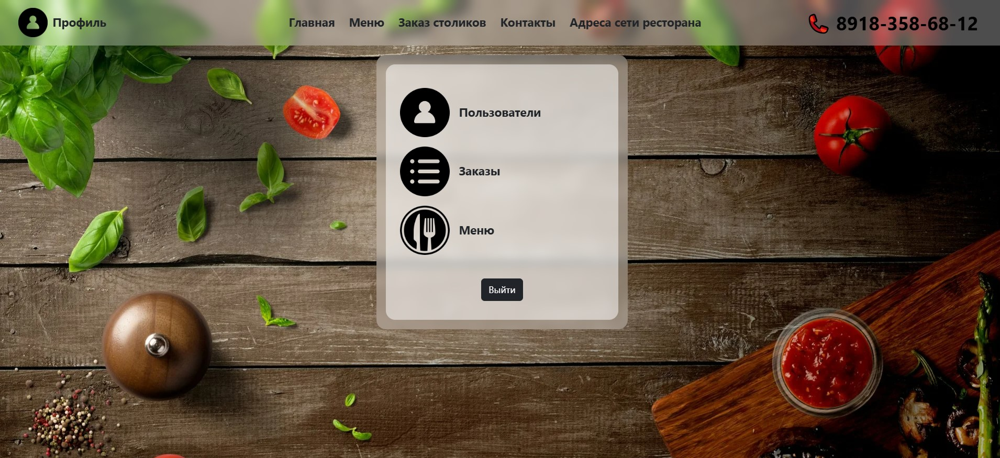
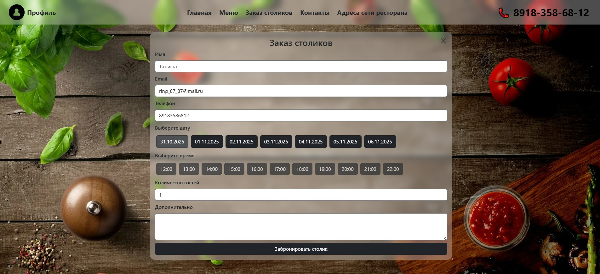
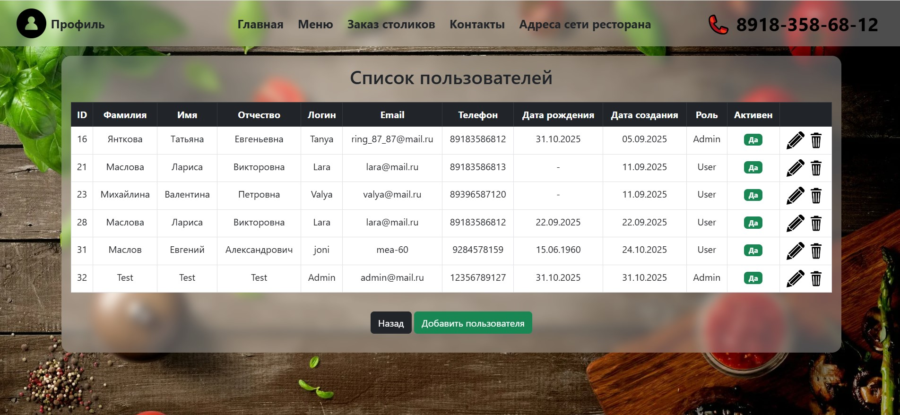
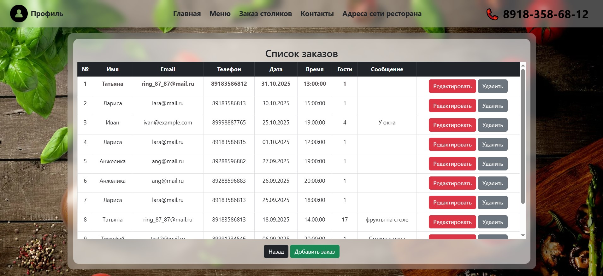
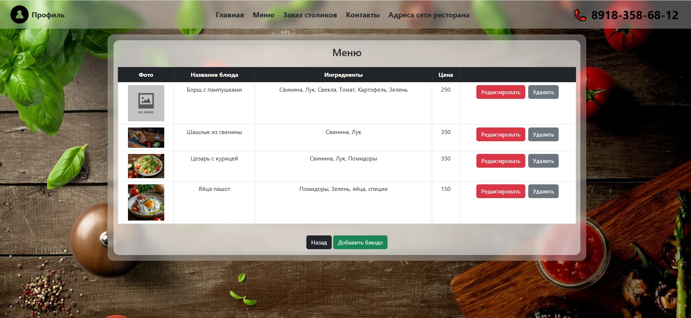
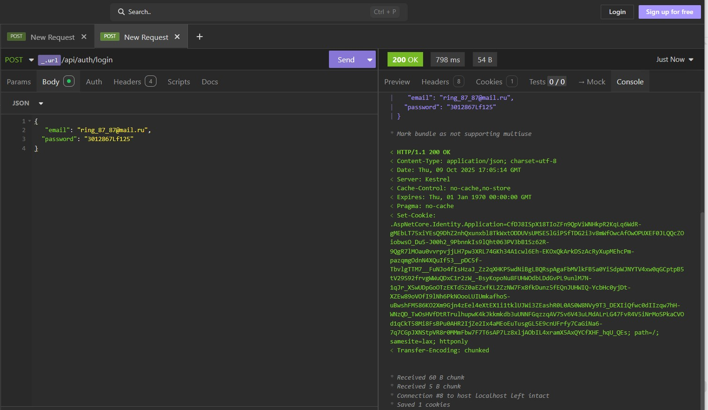

# Система управления рестораном

Веб-приложение для управления работой ресторана, включая бронирование столиков, администрирование меню и управление пользователями.
Система также предоставляет RESTful API для взаимодействия с внешними клиентами.

Разработано на ASP.NET Core 9.0 с использованием Entity Framework Core и ASP.NET Identity.

---

## 📖 Описание проекта

В этом проекте демонстрируется разработка веб-приложения с поддержкой базы данных, ориентированная на бэкэнд, с аутентификацией, управлением доступом на основе ролей и интеграцией REST API.

Приложение предназначено для поддержки двух основных ролей: пользователя и администратора , каждая из которых имеет разные уровни доступа.

---

## 🖼 Screenshots









---

## 🚀 Особенности

### 👤 Пользователь
- Регистрация и аутентификация с использованием ASP.NET Identity
- Функциональность бронирования столиков

### 🛠 Администратор
- Управление пользователями (создание, редактирование, удаление)
- Управление меню ресторана (добавление, редактирование, удаление блюд)
- Просмотр и управление бронированиями
- Административная панель для полного контроля над контентом и пользователями.

---

## 🛠 Технологический стек

| Компонент        | Технологии                                   |
|------------------|----------------------------------------------|
| Язык         | C#                                           |
| Рамки        | ASP.NET Core 9.0                             |
| ОРМ              | Entity Framework Core                        |
| База данных         | Microsoft SQL Server                         |
| Аутентификация  | ASP.NET Core Identity                        |
| API              | REST API (ASP.NET Core Web API)              |
| Внешний интерфейс         | Razor Pages, Bootstrap 5, JavaScript         |
| Стиль          | CSS                                          |
| Менеджер пакетов  | npm (Bootstrap)                              |

---

## 🧠 Что я реализовал

- Архитектура бэкэнда и бизнес-логика
- Аутентификация и авторизация на основе ролей
- RESTful API конечные точки
- Проектирование базы данных и миграция на Entity Framework Core.
- Настройка промежуточного программного обеспечения (сессии, аутентификация, авторизация)
- Конфигурация локализации и культуры
- Шаблоны асинхронного программирования в .NET

---

## ▶️ Как запустить проект

### 1. Клонируйте репозиторий (ветка EFIdentity).

```
git clone https://github.com/Tat-T/Restaurant.git
cd Restaurant
git checkout EFIdentity
```

### 2. Настройте базу данных.

Отредактируйте строку подключения в файле appsettings.json:

```
"ConnectionStrings": {
  "DefaultConnection": "Server=YOUR_SERVER;Database=RestaurantDB;Trusted_Connection=True;MultipleActiveResultSets=true;TrustServerCertificate=True"}
  ```

### 3. Примените миграции.
```
dotnet ef database update
```

### 4. Запустите приложение.
```
dotnet run
```

Или откройте проект в Visual Studio и нажмите F5.

Приложение будет доступно по адресу:
```
https://localhost:5015
```

🔑 Тестовые аккаунты

Администратор:

Email: admin@mail.ru

Password: Данные для прохождения тестирования предоставляются по запросу.

Пользователь:

Email: lara@mail.ru

Password: Данные для прохождения тестирования предоставляются по запросу.

🔌 Пример API

👩‍💻 Автор

Татьяна Янткова

Младший разработчик программного обеспечения (.NET), специализирующийся на разработке бэкенда и международных проектах.